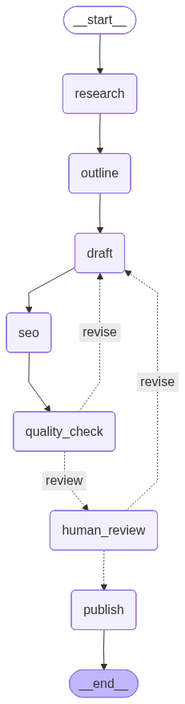

# BlogForge — Presentation Slides (5 slides)

> Markdown slide outline. Render with [Marp](https://marp.app/) (`marp blogforge_slides.md --pdf`),
> paste into PowerPoint/Google Slides, or present as-is. `---` separates slides.
> Each member should own ~1–2 slides so **all 3 speak** (rubric requirement).

---

## Slide 1 — Problem & Idea  *(0:00–1:00)*

# 📝 BlogForge
### The AI Blog Writer that reviews its own work

- **Problem:** writing a good blog post = hours of research, drafting, SEO, and editing.
- **Who it's for:** marketers, founders, and content teams who need quality drafts fast.
- **The idea:** an autonomous LangGraph agent that researches → drafts → self-scores →
  **retries if weak** → asks a human to approve before publishing.
- **Why we chose it:** it shows a *real* agent that makes decisions and recovers from
  its own mistakes — not just a linear chain.

> *Speaker: Member 1*

---

## Slide 2 — Architecture  *(1:00–2:30)*

# Workflow type: **Iterative + Conditional**

- **Sequential backbone:** research → outline → draft → seo → quality_check
- **Conditional edge #1 (`quality_check`):** score < 75 & retries left → **loop to draft**;
  else → human_review
- **Conditional edge #2 (`human_review`):** approve → publish; request edit → **loop to draft**
- **Persistence:** `MemorySaver` + `thread_id`; `interrupt()` pauses for the human

> *Speaker: Member 2 — walk through every node, edge, and decision point.*

---

## Slide 3 — Live Demo  *(2:30–4:30)*

# Demo

1. Enter a topic → watch the **live node tracker** (research → … → quality_check).
2. **Input A:** strong topic → high score → straight to human review → **approve & publish**.
3. **Input B:** at the review panel, click **Request edit** → graph **loops back** through
   draft → seo → quality_check → re-pause (demonstrates branching + looping).
4. Show the **quality badge**, then **download** the post as `.md` / `.json`.

*(Insert 2–3 screenshots of your own run here.)*

> *Speaker: Member 3 — run `streamlit run app.py` live.*

---

## Slide 4 — Challenges

# What was hard (and how we handled it)

- **Groq structured output:** `with_structured_output()` runs on tool-calling — kept
  Pydantic schemas flat and well-described for reliable parsing.
- **No-key web search:** used **DuckDuckGo (`ddgs`)** with a graceful fallback so the
  agent still works if search rate-limits or the network drops.
- **Human-in-the-loop in Streamlit:** cached the graph (`@st.cache_resource`) so the
  in-memory checkpoint + `thread_id` survive Streamlit reruns across approve/edit.
- **Self-correction:** capped the retry loop at 2 to avoid infinite rewriting.

> *Speaker: rotate / any member.*

---

## Slide 5 — What's Next

# Roadmap

- Swap MemorySaver for a **SQLite/Postgres checkpointer** for durable, multi-session history.
- **Parallel research** fan-out (multiple angles at once) then merge.
- Real **image generation** + automatic publishing to a CMS (WordPress/Ghost) API.
- A **fact-check node** that verifies claims against sources before publish.

# Thank you 🙌
*Questions? (4:30–5:00)*
